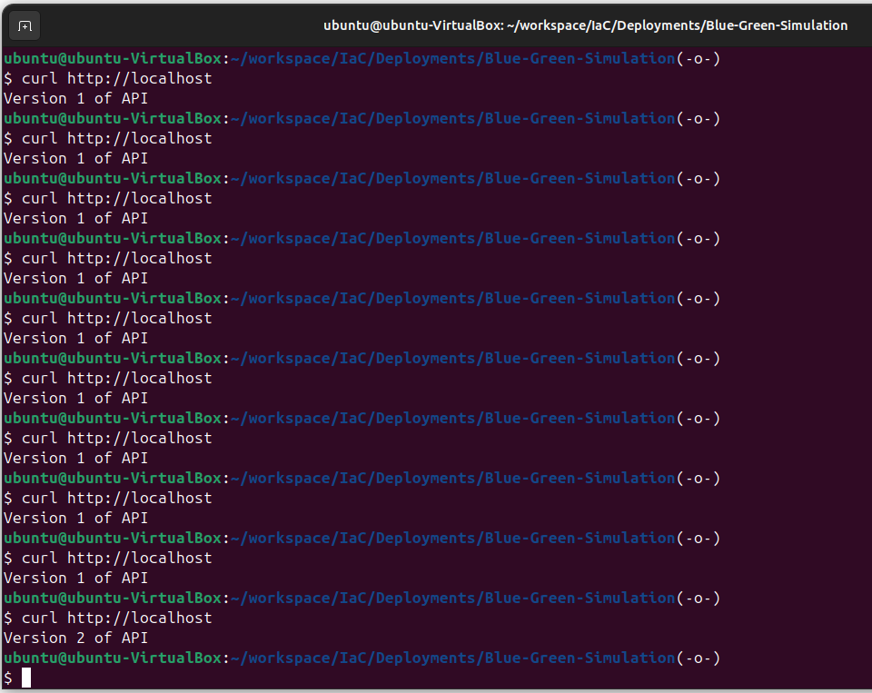

# Canary Deployment with C API

### Objective:

Deploy a basic API in C with two versions, and use HAProxy to simulate a canary deployment by routing only a subset of traffic to the "canary" version.

### Step 1: Create Two Versions of the API in C

We'll create two versions of a simple API in C. Each version will have a unique message to show which one is being accessed.

#### Directory Structure:

```
canary-deployment/
├── v1/
│   ├── api.c
│   └── Dockerfile
├── v2/
│   ├── api.c
│   └── Dockerfile
├── haproxy/
│   └── haproxy.cfg
└── docker-compose.yml
```

### API Code in C:

#### v1/api.c (Version 1 of the API):

#### v2/api.c (Version 2 of the API):

// This is identical to v1/api.c except for the response message.

```bash
char *response = "HTTP/1.1 200 OK\r\nContent-Type: text/plain\r\n\r\nVersion 2 of API";
```
### Dockerfile for Each Version (same for v1 and v2):

Create a Dockerfile in each folder (v1 and v2) with the following content:

```
FROM gcc:latest
WORKDIR /app
COPY api.c /app
RUN gcc -o api api.c
CMD ["./api"]
```

### Step 2: Set Up HAProxy Configuration

The haproxy.cfg will define rules for routing traffic between the v1 and v2 containers, simulating a canary deployment by sending only a portion of traffic to v2.

```
haproxy/haproxy.cfg:

    global
        log stdout format raw local0

    defaults
        log     global
        mode    http
        option  httplog
        timeout connect 5s
        timeout client  50s
        timeout server  50s

    frontend http_front
        bind *:80
        default_backend http_back

    backend http_back
        balance leastconn
        server v1_service v1:8080 check weight 10
        server v2_service v2:8080 check weight 1 # Send a fraction of traffic to v2
```

This configuration uses round-robin balancing, but gives the v2_service a lower weight to simulate a canary deployment.

### Step 3: Create Docker Compose File

The docker-compose.yml will define the containers for v1, v2, and HAProxy.

**docker-compose.yml:**

```Docker
version: '3'
services:
  v1:
    build:
      context: ./v1
    ports:
      - "8081:8080"

  v2:
    build:
      context: ./v2
    ports:
      - "8082:8080"

  haproxy:
    image: haproxy:latest
    volumes:
      - ./haproxy/haproxy.cfg:/usr/local/etc/haproxy/haproxy.cfg
    ports:
      - "80:80"
    depends_on:
      - v1
      - v2
```

### Step 4: Build and Run the Project

In the project directory, run:
```bash
docker compose up --build
```

Access the API at http://localhost in a browser or use curl:

curl http://localhost

Observe that some responses will show "Version 1 of API" while a subset of requests will receive "Version 2 of API," simulating a canary deployment.



This setup demonstrates a canary deployment in a local Docker environment with traffic partially directed to a new version for testing stability.