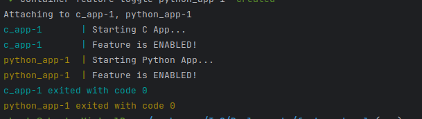
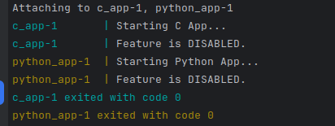

# Feature Toggles with Environment Variables

### This project demonstrates how to use environment variables to control feature toggling in applications written in both C and Python. By adjusting the FEATURE_ENABLED environment variable in Docker, you can enable or disable specific features in each application without modifying code.

**Project Structure**
```bash
feature-toggle/
├── c_app/
│   ├── app.c              # C application code
│   └── Dockerfile         # Dockerfile for C app
├── python_app/
│   ├── app.py             # Python application code
│   └── Dockerfile         # Dockerfile for Python app
├── docker-compose.yml     # Docker Compose file to run both apps with environment variables
```

**Requirements**
- Docker
- Docker Compose

**Setup Instructions**

Clone the Repository: 
```bash
git clone git@github.com:trinidadgithub/IaC.git
cd Deployments/feature-toggle
```

Run the Project: Build and start the containers using Docker Compose:

```bash
docker-compose up --build
```

Feature Toggle Configuration: The FEATURE_ENABLED environment variable controls the feature in both applications:
```bash
FEATURE_ENABLED=true will enable the feature.
FEATURE_ENABLED=false will disable the feature.
```

Modify the Feature Toggle: To change the toggle, edit docker-compose.yml and set FEATURE_ENABLED to either true or false for each app, then rebuild and restart:

```bash
docker-compose up --build
```

Example Output

When running the project, the output will vary based on the FEATURE_ENABLED setting in docker-compose.yml.

```bash
Feature Enabled: If FEATURE_ENABLED=true, the application will output:
```


```bash
Feature Disabled: If FEATURE_ENABLED=false, the application will output:
```

**Project Details**

- C Application (c_app/app.c): This application checks the FEATURE_ENABLED variable at runtime to determine whether to display "Feature is ENABLED" or "Feature is DISABLED."
- Python Application (python_app/app.py): This Python script uses the same FEATURE_ENABLED variable, demonstrating environment-based feature toggles in a Python application.
- Docker Compose: Docker Compose manages the containers for both applications, making it easy to set and modify environment variables.

**Why Feature Toggles?**

Feature toggles (or feature flags) allow you to control application features dynamically, enabling smoother rollouts, controlled testing, and rapid feature disabling if issues arise.
License

This project is open-source and available under the MIT License.