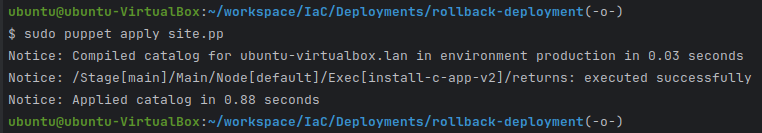

# Rollback Deployment

This project demonstrates an automated rollback deployment process using Puppet, Ubuntu package management, and a simulated failure condition. We use both C and Python applications, each packaged as .deb files, to showcase deploying a new version and rolling back to a previous stable version if an issue is detected.

**Project Structure**

```
rollback-deployment/
├── c_app/
│   ├── c-app-v1.deb          # Version 1 of the C application
│   └── c-app-v2.deb          # Version 2 of the C application
├── python_app/
│   ├── python-app-v1.deb     # Version 1 of the Python application
│   └── python-app-v2.deb     # Version 2 of the Python application
├── site.pp                   # Puppet manifest for automated deployment and rollback
└── uninstall.pp              # Puppet manifest for uninstalling the applications
```
### Requirements

    Ubuntu
    Puppet installed on the system (see installation steps below if needed)
    dpkg package manager for installing .deb files

### Setup
**Install Puppet on Ubuntu**
- Update your package list:
    ```commandline
    Sudo apt update
    ```
- Install Puppet:
    ```bash
    wget https://apt.puppetlabs.com/puppet7-release-focal.deb
    sudo dpkg -i puppet7-release-focal.deb
    sudo apt update
    sudo apt install puppet-agent
    ```
- Verify the installation:
    ```bash
    /opt/puppetlabs/bin/puppet --version
    ```

### Project Setup
- Ensure the .deb files for each version of both the C and Python applications are located in their respective folders.
- Update the paths in site.pp to match the location of each .deb file.

### Puppet Manifests
```bash
site.pp
```

The main Puppet manifest (site.pp) performs the following tasks:
- Simulate a Failure: Creates a "failure file" (/tmp/simulate_failure) to simulate an issue with the deployment.
- Install or Update to Version 2: Attempts to install version 2 of the application.
- Rollback to Version 1: If the failure file exists, it automatically rolls back to version 1.
- Cleans up in preparation for future tests.

**Contents of site.pp:**
```bash
node default {
    # Step 1: Simulate a failure by creating the failure file
    exec { 'simulate_failure':
        command => '/usr/bin/touch /tmp/simulate_failure',
        creates => '/tmp/simulate_failure',  # Only creates if it doesn't already exist
    }

    # Step 2: Attempt to install or update to version 2
    exec { 'install-c-app-v2':
        command => '/usr/bin/dpkg -i ./c_app1/c-app-v2.deb',
        unless  => '/usr/bin/dpkg -s c-app | grep -q \'Version: 2.0\'',
    }

    # Step 3: Roll back to version 1 if failure is detected (via the failure file)
    exec { 'rollback-to-v1':
        command => '/usr/bin/dpkg -i ./c_app/c-app-v1.deb',
        onlyif  => '/bin/test -f /tmp/simulate_failure',
    }

    # Optional Cleanup: Remove the failure file after rollback
    exec { 'cleanup_failure_file':
        command => '/usr/bin/rm -f /tmp/simulate_failure',
        onlyif  => '/bin/test -f /tmp/simulate_failure',
        require => Exec['rollback-to-v1'],
    }
}
```
```bash
uninstall.pp
```
Use uninstall.pp to uninstall the applications entirely if needed. It sets ensure => absent for the packages to remove them from the system.

**Contents of uninstall.pp:**
```
node default {
    package { 'c-app':
        ensure => absent,
    }

    package { 'python-app':
        ensure => absent,
    }
}
```

### Running the Deployment and Rollback

Run the main manifest (site.pp) to simulate the deployment with rollback:
```bash
sudo puppet apply site.pp
```

Uninstall the applications (optional):
```bash
sudo puppet apply uninstall.pp
```

**Explanation**

- Simulated Failure: The site.pp manifest creates a failure condition by touching the file /tmp/simulate_failure, simulating a failure in version 2.
- Automated Rollback: If the failure file exists, Puppet triggers the rollback to version 1 using the onlyif condition.
- Cleanup: The cleanup_failure_file resource removes the failure file after rollback to prepare for future tests.

### License

This project is open-source and available under the MIT License.